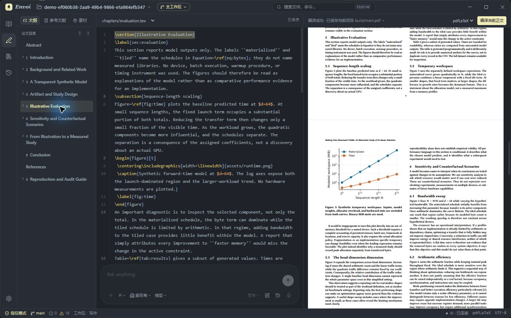
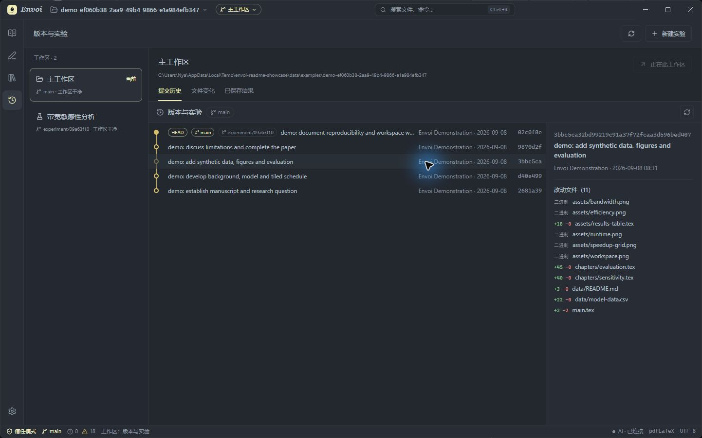

<div align="center">


# Envoi

**Turn ideas into papers. Keep experiments close.**

A local research workspace connecting reading, writing, and experimentation.

[](https://github.com/ChenMiaoi/Envoi/actions/workflows/ci.yml)
[](https://github.com/ChenMiaoi/Envoi/releases/latest)


[简体中文](README.zh-CN.md)

[Download](https://github.com/ChenMiaoi/Envoi/releases/latest) · [Features](#research-does-not-happen-only-in-the-manuscript) · [Run from source](#run-from-source) · [Contributing](CONTRIBUTING.md)

</div>



<p align="center"><sub>Organize papers, edit the manuscript, and inspect compilation results in one workspace.</sub></p>

## Research does not happen only in the manuscript

Behind a paper are the literature you read, methods you tried, data used to generate figures, and experiments you eventually abandoned.

Envoi keeps that work close to the paper: **the main workspace holds the paper, separate workspaces hold experiments, and saved results keep their provenance.** Reading notes, code, data, and writing no longer have to live in unrelated windows and directories.

| Reading                                                     | Writing                                                     | Experimenting                                          |
| :---------------------------------------------------------- | :---------------------------------------------------------- | :----------------------------------------------------- |
| Keep PDFs, papers, and notes in the project                 | View the LaTeX manuscript and PDF side by side              | Try different approaches in independent Git workspaces |
| Preview Markdown and edit CSV/TSV directly                  | Automatic outlines, references, assets, and diagnostics     | Inspect history, file changes, and saved results       |
| Preserve a reading position and conversation for each paper | Compile locally and jump from errors back to the manuscript | Bring results back while retaining their provenance    |

## Keep context while writing

- **LaTeX workbench**: chapter outline, references, and assets alongside PDFLaTeX / XeLaTeX compilation and PDF preview.
- **Multi-format reading and editing**: PDF, images, Markdown, CSV / TSV, and source code in the project's existing directory structure.
- **Project literature library**: import PDFs / BibTeX, organize papers and notes, and preserve note history and reading positions.
- **Optional AI assistant**: discuss, read, and revise within project and paper context. Configure your own model service first; context is sent to the selected provider when an external model is called.

## Give experiments their own space

New ideas do not have to overwrite the current paper. Create an experimental workspace, try changes, and bring back the results you need.



The file tree shows Git status with colors and badges; the version and experiment views bring together workspace state, commit history, and saved results. The evolution of a paper and the process of experimentation can be followed together.

## Familiar files, your own pace

Envoi works directly with local project files. Reading and manual editing are available in restricted mode; compilation, Git, and AI tools become available only after the project is trusted.

Fonts, font size, line height, theme, and shortcuts are configurable. When troubleshooting, export local diagnostic logs from Settings.

> Screenshots come from Envoi's independent demo project. The example paper and figures use synthetic data for workflow demonstration and do not represent real experimental results.

## Getting started

Download the installer for your platform from [GitHub Releases](https://github.com/ChenMiaoi/Envoi/releases/latest). Each release includes notes and file checksums.

| Platform | Package          |
| :------- | :--------------- |
| Windows  | `.exe` installer |
| macOS    | `.dmg` or `.zip` |

After opening the app, choose your own project or click **Open Example Project** to create an independent copy and explore the writing and experimentation workflow.

Prepare the following tools as needed:

| You want to                             | You need                                                                     |
| :-------------------------------------- | :--------------------------------------------------------------------------- |
| Read and edit files                     | Envoi only                                                                   |
| Compile LaTeX                           | A local TeX toolchain, such as TeX Live / MacTeX, with the required packages |
| Inspect versions and manage experiments | Git                                                                          |
| Run live LaTeX checks                   | ChkTeX (optional)                                                            |
| Use the AI assistant                    | A supported model service configured in Settings                             |

The app detects local tools and reports missing ones; it does not install them automatically. The macOS package is currently unsigned and not notarized. See [Desktop use and trust mode](docs/DESKTOP.md) for details.

## Run from source

Requires **Node.js 24+** and npm.

```sh
git clone https://github.com/ChenMiaoi/Envoi.git
cd Envoi
npm run setup
npm run dev
```

Development mode opens an Electron desktop window. AI configuration is optional; compilation and Git features require the tools described above.

<details>
<summary><strong>Development commands and layout</strong></summary>

| Command                | Purpose                                            |
| :--------------------- | :------------------------------------------------- |
| `npm run build`        | Type checking and build                            |
| `npm run lint`         | Static checks                                      |
| `npm test`             | Core logic tests                                   |
| `npm run test:desktop` | Desktop interaction regression tests after a build |
| `npm run test:local`   | Local TeX, Git, ChkTeX, and related tool checks    |
| `npm run test:ai`      | AI integration and data migration checks           |
| `npm run package:win`  | Build the Windows installer                        |
| `npm run package:mac`  | Build the macOS installer                          |

```text
app/
  src/                 interface and interaction
  electron/            desktop main process and bridge
  server/              local tools and data services
  scripts/             development and validation utilities
  tests/               tests
examples/demo/         example paper, figures, and synthetic data
docs/                  user, architecture, and release documentation
```

The dependency lockfile is `app/package-lock.json`. See [CONTRIBUTING.md](CONTRIBUTING.md) for the complete development guide.

</details>

## Documentation and contributing

[Desktop use](docs/DESKTOP.md) · [Reading and file formats](docs/READER_AND_LIBRARY.md) · [Project literature library](docs/research-library.md) · [Settings](docs/SETTINGS.md) · [Release process](docs/RELEASE.md)

Use [Issues](https://github.com/ChenMiaoi/Envoi/issues) for feedback. Include the app version, operating system, reproduction steps, and screenshots or logs without private content when reporting a problem. Read the [contribution guide](CONTRIBUTING.md) before submitting code.

## License and acknowledgements

Envoi's original code is released under the [Apache License 2.0](LICENSE). Third-party dependencies, paper templates, and other distributed materials remain under their respective licenses; see [THIRD_PARTY.md](THIRD_PARTY.md). The Envoi name and logo are not licensed as trademarks by the software license.
