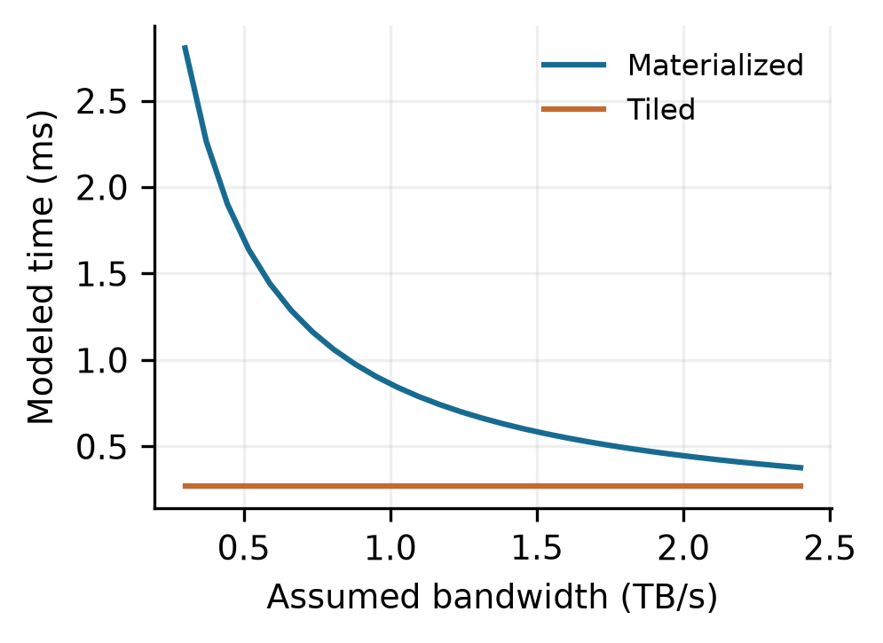

# Envoi Markdown Showcase

This file exercises every styled element of the reading preview: headings, emphasis, links, code, quotes, callouts, tables, math, and lists. Open it in the reader and switch themes in **Settings → General** to see each palette.

## Typography

Body text sits at a softened foreground tone for long reading sessions. **Bold phrases pick up the theme's warm accent**, *italic stays neutral*, and ~~strikethrough~~ is muted. Inline code like `compile(root)` renders as a bordered chip, and links such as the [ACM acmart class](https://www.ctan.org/pkg/acmart) carry a translucent underline that solidifies on hover.

### Third-level heading

Hierarchy past `h2` returns to the plain heading color so long documents stay calm.

#### Fourth-level heading

Used sparingly for sub-subsections.

## Lists

- Unordered markers take the accent color
- Second item
  - Nested item
  - Another nested item

1. Ordered items keep numeric markers
2. The pipeline is: parse, decorate, render

- [x] A finished task
- [ ] An open task

## Quotes

> An ordinary blockquote keeps the quiet left bar and faint background.

## Callouts

> [!note]
> The default callout. Use it for asides that should not interrupt the flow.

> [!tip] Custom titles work inline
> Anything after the marker on the first line becomes the card title.

> [!warning]
> Warnings and cautions use the yellow hue slot.

> [!important]
> Important callouts use pink; questions use violet.

> [!danger]
> Danger, failure, error, and bug collapse into the red kind.

> [!quote]
> Quotes and citations use the muted sage slot.

> [!example]
> Examples use orange; abstracts use cyan; todos use pink.

## Tables

| Model | Seq len | Heads | Throughput | Accuracy |
|-------|--------:|------:|-----------:|---------:|
| Tiny  | 512     | 8     | 41.2k tok/s | 71.3%   |
| Small | 1024    | 12    | 18.7k tok/s | 74.8%   |
| Base  | 2048    | 16    | 9.4k tok/s  | 79.1%   |

Tables render with a rounded frame, tinted header row, and zebra striping.

## Code

```python
def compile_document(root: Path) -> BuildResult:
    """Fenced blocks keep the editor background and monospace font."""
    result = engine.run(root)
    return result.artifacts["main.pdf"]
```

## Math

Inline math like $E = mc^2$ stays in the text flow, and display math centers itself:

$$
\frac{\partial}{\partial t} \Psi = \frac{i\hbar}{2m} \nabla^2 \Psi
$$

## Media



---

*End of showcase. Delete nothing; this file is the visual regression reference for the prose layer.*
